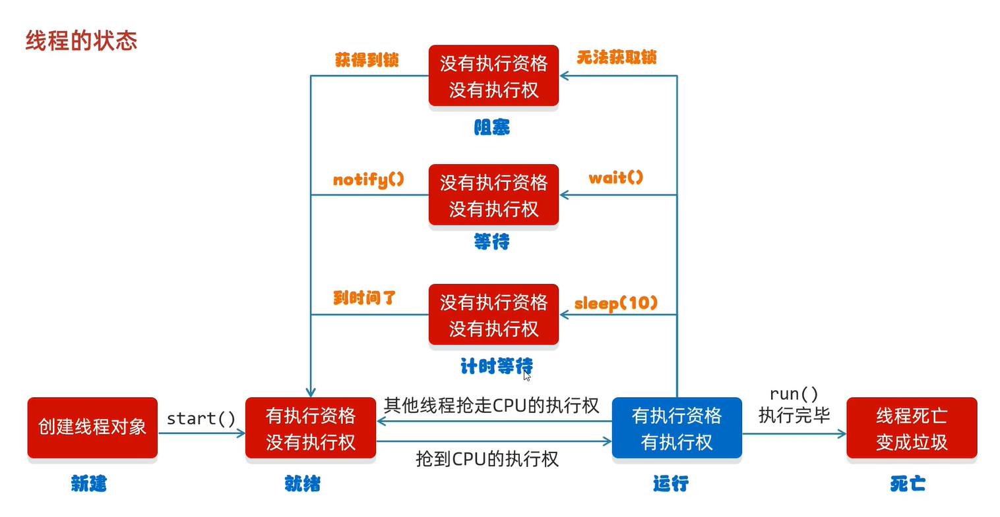
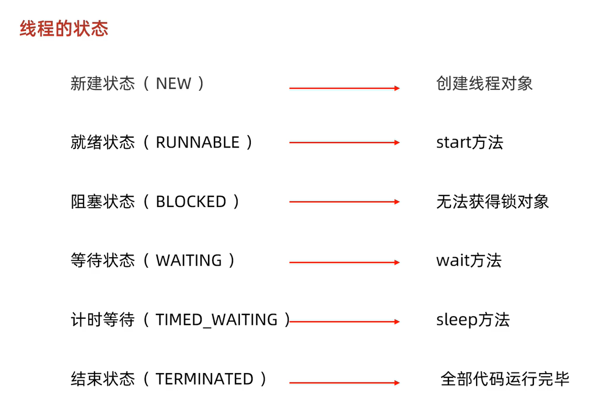

### 1、基础

### 2、进阶

sleep()方法

       sleep()方法是线程类（Thread）的静态方法，让调用的线程进入指定时间睡眠状态，使得当前线程进入阻塞状态，告诉系统至少在指定时间内不需要为线程调度器为该线程分配执行时间片，给执行机会给其他线程（实际上，调用sleep()方法时并不要求持有任何锁，即sleep()可在任何地方使用。），但是监控状态依然保持，到时后会自动恢复。
    
       当线程处于上锁时，sleep()方法不会释放对象锁，即睡眠时也持有对象锁。只会让出CPU执行时间片，并不会释放同步资源锁。
    
       sleep()休眠时间满后，该线程不一定会立即执行，这是因为其他线程可能正在运行而起没有被调度为放弃执行，除非此线程具有更高的优先级。
    
       sleep()必须捕获异常，在sleep的过程中过程中有可能被其他对象调用它的interrupt(),产生InterruptedException异常，如果你的程序不捕获这个异常，线程就会异常终止，进入TERMINATED状态，如果你的程序捕获了这个异常，那么程序就会继续执行catch语句块(可能还有finally语句块)以及以后的代码。
    
       在没有锁的情况下，sleep()可以使低优先级的线程得到执行的机会，当然也可以让同优先级、高优先级的线程有执行的机会。

wait()方法

       wait()方法是Object类里的方法，当一个线程执行wait()方法时，它就进入到一个和该对象相关的等待池中（进入等待队列，也就是阻塞的一种，叫等待阻塞），同时释放对象锁，并让出CPU资源，待指定时间结束后返还得到对象锁。
    
       wait()使用notify()方法、notiftAll()方法或者等待指定时间来唤醒当前等待池中的线程。等待的线程只是被激活，但是必须得再次获得锁才能继续往下执行，也就是说只要锁没被释放，原等待线程因为为获取锁仍然无法继续执行。notify的作用只负责唤醒线程，线程被唤醒后有权利重新参与线程的调度。
    
       wait()方法、notify()方法和notiftAll()方法用于协调多线程对共享数据的存取，所以只能在同步方法或者同步块中使用，否则抛出IllegalMonitorStateException。

两者的区别

       （1）属于不同的两个类，sleep()方法是线程类（Thread）的静态方法，wait()方法是Object类里的方法。
    
       （2）sleep()方法不会释放锁，wait()方法释放对象锁。
    
       （3）sleep()方法可以在任何地方使用，wait()方法则只能在同步方法或同步块中使用。
    
       （4）sleep()使线程进入阻塞状态（线程睡眠），wait()方法使线程进入等待队列（线程挂起），也就是阻塞类别不同。

**在jdk的源码中，线程只有六种状态，没有《运行》这种状态，因为这个时候jvm已经将线程交给了操作系统**

