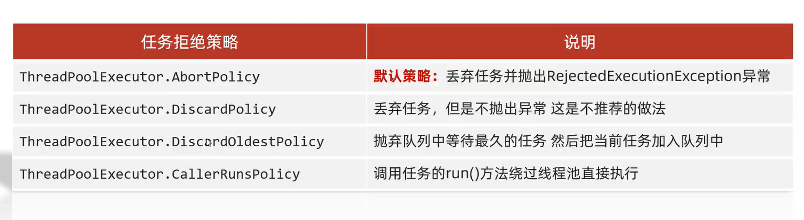
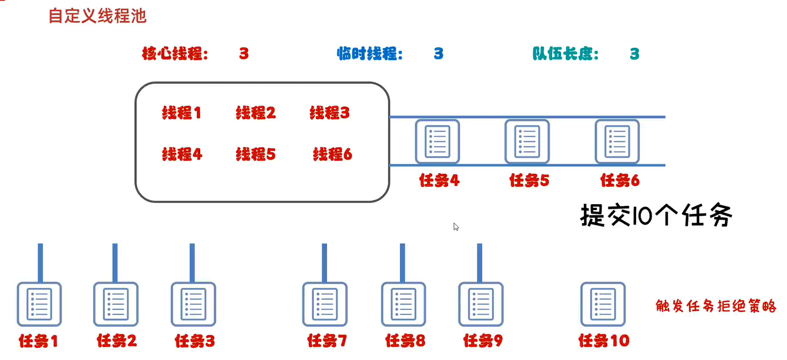

## 一、**线程池的7大核心参数** 

## 

### 1.corePoolSize 

​      核心线程数，核心线程会一直存活，即使没有任务需要执行，当线程数小于核心线程数时，即使有线程空闲，线程池也会优先创建新线程处理，当设置allowCoreThreadTimeout=true（默认false）时，核心线程会超时关闭

### 2. maximumPoolSize 最大线程数目

​    当空闲线程时间达到 keepAliveTime，线程会关闭，直到数量等于corePoolSize

### 3.keepAliveTime空闲时间

### 4.unit 时间单位 

​     超过核心线程的生存时间单位，如秒、毫秒等。

### 5. workQueue [阻塞队列]

​    [LinkedBlockingQueue]：无界队列，容量Integer.MAX_VALUE，（FixedThreadPool 和 SingleThreadExecutor 线程池的线程数是固定的，用的就是LinkedBlockingQueue）

​    SynchronousQueue：直接提交的任务队列（CachedThreadPool 的最大线程数是 Integer.MAX_VALUE，用的是SynchronousQueue）

​    [ArrayBlockingQueue]：指定队列大小（corePoolSize >队列>maximumPoolSize ）

### 6. threadFactory 线程工厂

​       可以定制线程对象的创建，例如设置线程名字、是否是守护线程等。

### 7. handler 拒绝策略

1. ​    AbortPolicy：终止策略。超过最大承载、执行拒绝任务时，会直接抛出一个类型为RejectedExecutionException 的RuntimeException异常，默认的拒绝策略就是它
2. ​    DiscardPolicy：丢弃策略。超过承载，丢弃任务。但是不抛出异常
3. ​    DiscardOldestPolicy：丢弃最早任务策略。新任务替换老任务，对应参考图中会丢弃任务4，将任务10添加到末尾
4. ​    CallerRunsPolicy：调用者执行策略。调用认为的run方法直接执行，不需要线程池
5. ​    实现RejectedExecutionHandler接口，自定义策略

参考图：

